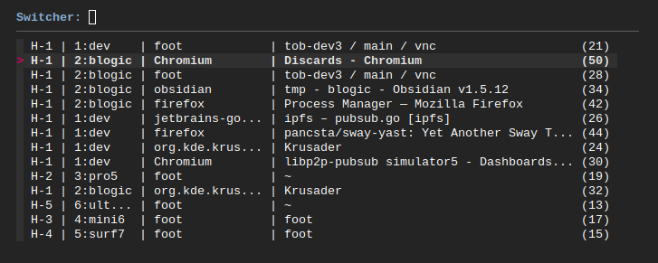
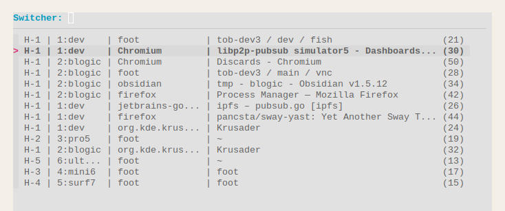

# sway-yast

**Y**et **A**nother **S**way **T**ab is a single-binary alt+tab clone (Most Recently Used) window switcher for [Sway WM](https://github.com/swaywm/sway).

## Features

1. Daemon (IPC & RPC) architecture, filesystem-free
2. Uses `fzf`, works in the terminal
3. Renders a popup using `foot` (optional)
4. Dark mode support (optional) 
   Checks `gsettings get org.gnome.desktop.interface color-scheme`
5. Shows workspaces and outputs (especially headless)
6. 1-hand compatible keystrokes

## Usage

1. Install 
   `go install github.com/pancsta/sway-yast@latest`
2. Start the daemon 
   `sway-yast daemon`
3. Add a binding (optional) 
   `swaymsg bindsym alt+tab exec sway-yast switcher`
4. Run in the terminal (optional) 
   `sway-yast fzf`
5. Press `alt+tab`

## Key bindings

Normal mode:

- `alt+tab` show the switcher, preselect the previous window, enter `Switcher` mode

Switcher mode:

- `space` focus the selected window, close the switcher
- `enter` focus the selected window, close the switcher
- `tab` select the next window in the list
- `down` select the next window in the list
- `shift+tab` select the previous window in the list
- `up` select the previous window in the list
- `esc` close the switcher
- `ctrl+c` close the switcher
- `a-z`, `0-9` fuzzy search

Example - switch to the 3nd MRU window:

- `alt+tab`
- `tab`
- `space`

Example - switch to Krusader by name:

- `alt+tab`
- `k`, `r`, `u`
- `enter`

## Configuration

See the [config section in main.go](main.go), modify and `go build`.

## Kudos

- [applist.py](https://github.com/davxy/dotfiles/blob/main/_old/sway/applist.py)
- [sway-fzfify](https://github.com/ldelossa/sway-fzfify)
- [Difrex/gosway](https://github.com/Difrex/gosway)
