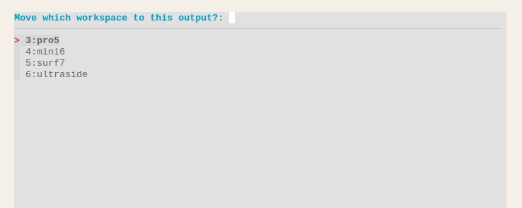
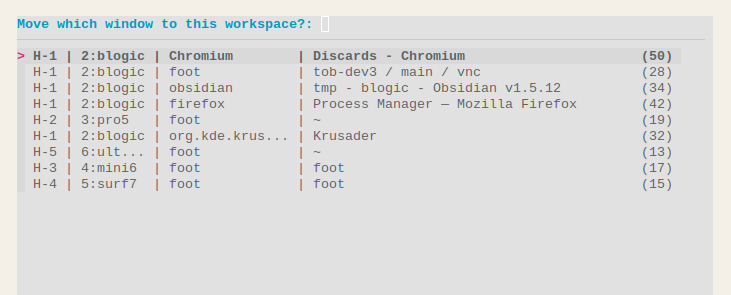
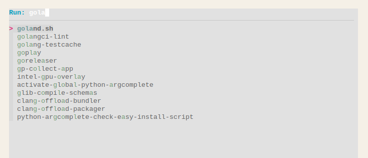

# sway-yast

Sway **Y**et **A**nother **S**way **T**ab is a text-based window switcher which mimics alt+tab behavior (Most Recently Used order)
for [Sway WM](https://github.com/swaywm/sway).


| Dark Mode                                | Light Mode                               |
|------------------------------------------|------------------------------------------|
|  |  |

```text
$ sway-yast --help
Usage:
  sway-yast [flags]
  sway-yast [command]

Available Commands:
  completion     Generate the autocompletion script for the specified shell
  config         Change the config of a running daemon process
  daemon         Start tracking focus in sway
  fzf            Run fzf with a list of windows
  fzf-path       Run fzf with a list of executable files from PATH
  fzf-pick-space Run fzf with a list of workspaces to pick
  fzf-pick-win   Run fzf with a list of windows to pick
  help           Help about any command
  mru-list       Print a list of MRU window IDs
  path           Show the +x files from PATH using foot
  pick-space     Show the workspace picker using foot
  pick-win       Show the window picker using foot
  switcher       Show the switcher window using foot

Flags:
  -h, --help      help for sway-yast
      --version   Print version and exit

Use "sway-yast [command] --help" for more information about a command.
```

```text
$ sway-yast daemon --help
Start tracking focus in sway

Usage:
  sway-yast daemon [flags]

Flags:
      --autoconfig            Automatic configuration of layout (default true)
      --default-keybindings   Add default keybindings
  -h, --help                  help for daemon
      --mouse-follows-focus   Calls 'input ... map_to_output OUTPUT' on each focus

```

## features

- daemon (IPC & RPC) architecture, filesystem-free
- uses `fzf`, so it works in the terminal
- renders a floating popup using `foot` (optional)
- dark mode support (optional)<br />
  checks `gsettings get org.gnome.desktop.interface color-scheme`
- 1-hand keystrokes
- [mouse follows focus](#mouse-follows-focus) mode (optional)
- additional features (popups)
    - move a workspace to the current output
    - move a window to the current workspace
    - run anything in your `PATH`
- general MRU watcher via `mru-list` 

## usage

1. Install using either<br />
   - binary from [the releases page](https://github.com/pancsta/sway-yast/releases/latest)
   - `go install github.com/pancsta/sway-yast@latest`
   - `git clone && go mod tidy && go build`
2. Start the daemon<br />
   `sway-yast daemon --default-keystrokes`
3. Use directly in the terminal (optional)<br />
   `sway-yast fzf`
4. Press `alt+tab`

## keystrokes

Normal mode:

- `alt+tab` show the switcher, preselect the previous window, enter `Switcher` mode

Switcher mode:

- `space` focus the selected window, close the switcher
- `enter` focus the selected window, close the switcher
- `tab` select the next window in the list
- `down` select the next window in the list
- `shift+tab` select the previous window in the list
- `up` select the previous window in the list
- `esc` close the switcher
- `ctrl+c` close the switcher
- `a-z`, `0-9` fuzzy search

Example - switch to the 3nd MRU window:

- `alt+tab`
- `tab`
- `space`

Example - switch to Krusader by name:

- `alt+tab`
- `k`, `r`, `u`
- `enter`

### default keystrokes

Various ways to get the default keybindings.

```bash
$ sway-yast daemon --default-keybindings
```

```bash
# shell
swaymsg bindsym alt+tab exec sway-yast switcher
swaymsg bindsym mod4+o exec sway-yast pick-space
swaymsg bindsym mod4+p exec sway-yast pick-win
swaymsg bindsym mod4+d exec sway-yast path
```

```text
# config
bindsym alt+tab exec sway-yast switcher
bindsym $mod+o exec sway-yast pick-space
bindsym $mod+p exec sway-yast pick-win
bindsym $mod+d exec sway-yast path
```

## mouse follows focus

```bash
$ sway-yast daemon --mouse-follows-focus
```

Using `input map_to_output`, traps the relative cursor inside the currently focused output. Changing focus moves the cursor between outputs (thus the name). Useful for VNC screens on separate machines. When combined with [waycorner](https://github.com/AndreasBackx/waycorner), it creates a synergy-like effect.

### waycorner config example

```toml
# HEADLESS-1 (right screen)
[pro5-left]
enter_command = [ "sway-pointer-output", "2" ]
locations = ["left"]
[pro5-left.output]
description = ".*output 1.*"

# HEADLESS-2 (left screen)
[mini6-right]
enter_command = [ "sway-pointer-output", "1" ]
locations = ["right"]
[mini6-right.output]
description = ".*output 2.*"
```

## configuration

See the [top config section in internal/pkg/daemon.go](internal/pkg/daemon.go), modify and `go build cmd/sway-yast/*.go`.

## additional features (popups)

### move a workspace to the current output



### move a window to the current workspace



### run anything in your `PATH`



## troubleshooting

`env YAST_LOG=1 sway-yast`

## development

- `go build cmd/sway-yast/main.go`
- `env YAST_LOG=1 YAST_DEBUG=1 ./main deamon`
- `env YAST_LOG=1 YAST_DEBUG=1 ./main switcher`

## changelog

See [CHANGELOG.md](CHANGELOG.md).

## kudos

- [applist.py](https://github.com/davxy/dotfiles/blob/main/_old/sway/applist.py)
- [sway-fzfify](https://github.com/ldelossa/sway-fzfify)
- [Difrex/gosway](https://github.com/Difrex/gosway)
